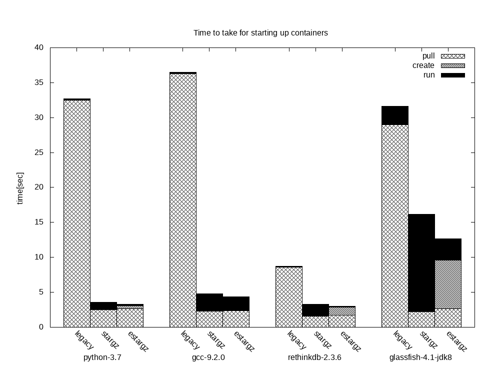

# Stargz Snapshotter

[](https://github.com/containerd/stargz-snapshotter/actions?query=workflow%3ATests+branch%3Amaster)
[](https://github.com/containerd/stargz-snapshotter/actions?query=workflow%3ABenchmark+branch%3Amaster)

Read also introductory blog: [Startup Containers in Lightning Speed with Lazy Image Distribution on Containerd](https://medium.com/nttlabs/startup-containers-in-lightning-speed-with-lazy-image-distribution-on-containerd-243d94522361)

Pulling image is one of the time-consuming steps in the container lifecycle. Research shows that time to take for pull operation accounts for 76% of container startup time[[FAST '16]](https://www.usenix.org/node/194431). *Stargz Snapshotter* is an implementation of snapshotter which aims to solve this problem by *lazy pulling* leveraging [stargz image format by CRFS](https://github.com/google/crfs). The following histogram is the benchmarking result for startup time of several containers measured on Github Actions, using Docker Hub as a registry.



`legacy` shows the startup performance when we use containerd's default snapshotter (`overlayfs`) with images copied from `docker.io/library` without optimization. For this configuration, containerd pulls entire image contents and `pull` operation takes accordingly. When we use stargz snapshotter with `stargz` images we are seeing performance improvement on the `pull` operation because containerd can start the container before the entire image contents locally available and fetches each file on-demand. But at the same time, we see the performance drawback for `run` operation because each access to files takes extra time for fetching them from the registry. When we use the further optimized version of images(`estargz`) we can mitigate the performance drawback observed in `stargz` images. This is because [stargz snapshotter prefetches and caches some files which will be most likely accessed during container workload](./docs/stargz-estargz.md). Stargz snapshotter waits for the first container creation until the prefetch completes so `create` sometimes takes longer than other types of image. But this wait only occurs just after the pull completion until the prefetch completion and it's shorter than waiting for downloading all files of all layers.

The above histogram is [the benchmarking result on the commit `288c338`](https://github.com/containerd/stargz-snapshotter/actions/runs/50632674). We are constantly measuring the performance of this snapshotter so you can get the latest one through the badge shown top of this doc. Please note that we sometimes see dispersion among the results because of the NW condition on the internet and the location of the instance in the Github Actions, etc. Our benchmarking method is based on [HelloBench](https://github.com/Tintri/hello-bench).

Stargz Snapshotter is a **non-core** sub-project of containerd.

## Quick Start with Kubernetes

For using stargz snapshotter on kubernetes nodes, you need the following configuration to containerd as well as run stargz snapshotter daemon on the node. We assume that you are using containerd newer than at least [commit `d8506bf`](https://github.com/containerd/containerd/commit/d8506bfd7b407dcb346149bcec3ed3c19244e3f1) as a CRI runtime.

```toml
version = 2

# Plug stargz snapshotter into containerd
# Containerd recognizes stargz snapshotter through specified socket address.
# The specified address below is the default which stargz snapshotter listen to.
[proxy_plugins]
  [proxy_plugins.stargz]
    type = "snapshot"
    address = "/run/containerd-stargz-grpc/containerd-stargz-grpc.sock"

# Use stargz snapshotter through CRI
[plugins."io.containerd.grpc.v1.cri".containerd]
  snapshotter = "stargz"
```

This repo contains [a Dockerfile as a KinD node image](./Dockerfile) which includes the above configuration. You can use it with [KinD](https://github.com/kubernetes-sigs/kind) like the following,

```console
$ docker build -t stargz-kind-node https://github.com/containerd/stargz-snapshotter.git
$ kind create cluster --name stargz-demo --image stargz-kind-node
```

Then you can create stargz pods on the cluster. In this example, we create a stargz-converted Node.js pod (`stargz/node:13.13-esgz`) as a demo.

```yaml
apiVersion: v1
kind: Pod
metadata:
  name: nodejs
spec:
  containers:
  - name: nodejs-stargz
    image: stargz/node:13.13.0-esgz
    command: ["node"]
    args:
    - -e
    - var http = require('http');
      http.createServer(function(req, res) {
        res.writeHead(200);
        res.end('Hello World!\n');
      }).listen(80);
    ports:
    - containerPort: 80
```

The following command lazily pulls `stargz/node:13.13.0-esgz` from Docker Hub and creates the pod so the time to take for it is shorter than the original image `library/node:13.13`.

```console
$ kubectl --context kind-stargz-demo apply -f stargz-pod.yaml && kubectl get po nodejs -w
$ kubectl --context kind-stargz-demo port-forward nodejs 8080:80 &
$ curl 127.0.0.1:8080
Hello World!
```

Stargz snapshotter also supports further configuration including private registry authentication, mirror registries, etc.
For more details, refer to the [overview doc](./docs/overview.md).

## Creating stargz images and further optimization

For lazy pulling images, you need to prepare stargz images first. You can use [CRFS-official `stargzify`](https://github.com/google/crfs/tree/master/stargz/stargzify) command or our `ctr-remote` command which has further optimization functionality. You can also try our pre-converted images listed in [this doc](./docs/pre-converted-images.md). For more details about stargz and the optimization, refer to [this doc](./docs/stargz-estargz.md)

In this section, we introduce `ctr-remote` command for converting images into stargz with further optimization for the performance of reading files. On-demand lazy pulling improves the performance of pull but it has runtime performance penalty because reading files induce remotely downloading contents. For solving this, `ctr-remote` has *workload-based* optimization for images. This section shows how to convert and pull an image lazily using `ctr-remote` command and briefly describes workload-based optimization.

First, prepare the demo environment with the following command (put this repo on `${GOPATH}/src/github.com/containerd/stargz-snapshotter`).

```console
$ cd ${GOPATH}/src/github.com/containerd/stargz-snapshotter/script/demo
$ docker-compose build containerd_demo
$ docker-compose up -d
$ docker exec -it containerd_demo /bin/bash
(inside container) # ./script/demo/run.sh
```

Generally, container images are built with purpose and the *workloads* are defined in the Dockerfile with some parameters including entrypoint command, environment variables and user. By default, `ctr-remote` optimizes the performance of reading files that are most likely accessed in the workload defined in the Dockerfile. You can also specify the custom workload using options.

The following example converts the legacy `library/ubuntu:18.04` image into stargz. The command also optimizes the image for the workload of executing `ls` on `/bin/bash`. The thing actually done is it runs the specified workload in a sandboxed environment and profiles all file accesses. Then these files are marked in the image as likely accessed also in production. Then it pushes the converted image to the local registry (`registry2:5000`). The converted image is still __docker-compatible__ so you can run it with other runtimes (e.g. Docker).

```console
# ctr-remote image optimize --plain-http --entrypoint='[ "/bin/bash", "-c" ]' --args='[ "ls" ]' ubuntu:18.04 http://registry2:5000/ubuntu:18.04
```

Finally, the following commands pull the stargz image lazily. Stargz snapshotter prefetches files that are most likely accessed in the optimized workload, which hopefully increases the cache hit rate for that workload and mitigates runtime overheads as shown in the benchmarking result shown top of this doc.

```console
# ctr-remote images rpull --plain-http registry2:5000/ubuntu:18.04
fetching sha256:728332a6... application/vnd.docker.distribution.manifest.v2+json
fetching sha256:80026893... application/vnd.docker.container.image.v1+json
# ctr-remote run --rm -t --snapshotter=stargz registry2:5000/ubuntu:18.04 test /bin/bash
root@8dab301bd68d:/# ls
bin  boot  dev  etc  home  lib  lib64  media  mnt  opt  proc  root  run  sbin  srv  sys  tmp  usr  var
```

## Project details

Stargz Snapshotter is a containerd **non-core** sub-project, licensed under the [Apache 2.0 license](./LICENSE).
As a containerd non-core sub-project, you will find the:
 * [Project governance](https://github.com/containerd/project/blob/master/GOVERNANCE.md),
 * [Maintainers](./MAINTAINERS),
 * and [Contributing guidelines](https://github.com/containerd/project/blob/master/CONTRIBUTING.md)

information in our [`containerd/project`](https://github.com/containerd/project) repository.
