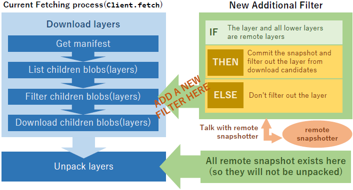
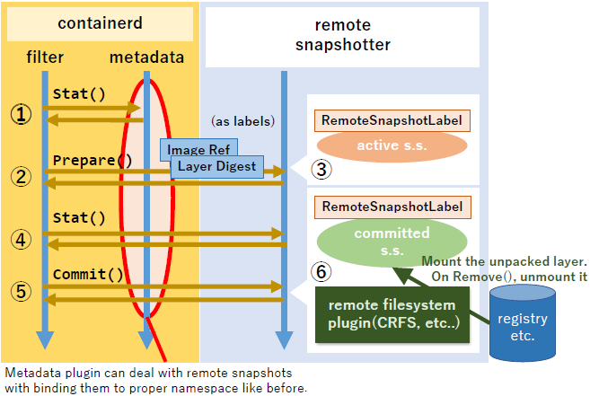
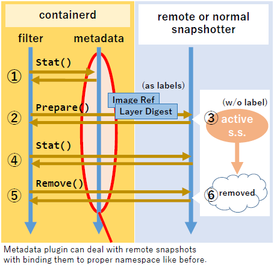

# Remote Snapshotter Architecture

This is an example implementation of a containerd's *remote snapshotter*.

To see the implementation:
- Remote snapshotter: [/snapshotter.go](/snapshotter.go)
- Remote FileSystem Plugin: [/filesystems/plugin.go](/filesystems/plugin.go) and [/filesystems/stargz/](/filesystems/stargz)
- Remote Snapshotter patch for containerd: [remote-snapshotter branch](https://github.com/ktock/containerd/commit/53110e516e5b4c0cd5b81f61c01fd5e33a25edef)

Related containerd's issue is [#2963](https://github.com/containerd/containerd/issues/2943).

## Overview

Among container's lifecycle, pulling image is one of the biggest performance bottleneck on container startup processes.
One research shows that time for pulling accounts for 76% of container startup time[[FAST '16]](https://www.usenix.org/node/194431).

There some projects to solve the issue:

- [CRFS](https://github.com/google/crfs)
- [CernVM-FS](https://github.com/containerd/containerd/pull/2467)
- [FILEgrain](https://github.com/AkihiroSuda/filegrain)
- [Slacker](https://www.usenix.org/node/194431)

Remote snapshotter is one of the solutions [discussed in the containerd community](https://github.com/containerd/containerd/issues/2943) and this remote snapshotter's implementation is also based on the discussion.
By plugging this snapshotter into [patched version of containerd](https://github.com/ktock/containerd/tree/remote-snapshotter)(mentioned below), we can boot a container without pulling layer contents which exists on remote stores.
Our implementation uses [stargz by CRFS](https://github.com/google/crfs) as image format, which has following feature:

- We can use docker registry as a backend store (means w/o additional layer stores).
- The stargz-formatted image is still docker-compatible (means normal runtimes can still use the formatted image).

Currently, we need to use [a patched version of containerd](https://github.com/ktock/containerd/tree/remote-snapshotter) to make it work with our remote snapshotter.

## About the patch on containerd

To make containerd work with remote snapshotter, it needs to:

- Skip downloading layers which can be prepared without downloading contents by a remote snapshotter(we call it "remote layer" here).
- Make snapshots which is backed by the remote store without "Unpack" operation on the snapshots(we call it "remote snapshot" here).
- Make the remote snapshot work with metadata snapshotter so that containerd can bind these snapshots to namespaces

We can acheve it by introducing additional filter during fetcing process(in the [Client.fetch](https://github.com/containerd/containerd/blob/614c0858f2a8db9ee0c788a9164870069f3e53ed/pull.go#L108) method).
Currently, there are already some filters in the method, so we can implement a new filter easily by following the manners of these existing filter.

The filter takes lists of layers to be downloaded(we call "download candidates" here) and check if each layer and the lower layers are remote layers.
If so, it filters out the layer from the download candidates and make the snapshot as a remote snapshot.
Containerd doesn't unpack layers if the layers already exist as snapshots, so we can avoid unpacking these remote layers.
The filter talks with remote snapshotters to know whether a layer is a remote layer.

## The protocol between containerd and the remote snapshotter

The filter talks with remote snapshotters to know whether a layer is a remote layer.
If so, it makes the remote snapshot.

1. The filter Stat() the layer with ChainID of the layer.
2. If the snapshot doesn't exist, the filter attempts to Prepare() the layer as a remote snapshot with the layer's basic information as labels(image ref and layer digest).
3. If remote snapshotter takes layer's basic information, it checks if the specified layer is a remote layer. If so, the remote snapshotter MUST prepare an active snapshot with applying a label "RemoteSnapshotLabel" automatically.
4. The filter Stat() the active snapshot to check if layer is a remote layer by seeing the label applied to the active snapshot.
5. Only if the snapshot has the label, the filter Commit() it immediately and filter out this layer from the download candidates.
6. Remote snapshotter checks if this active snapshot is a remote snapshot. If so, it mounts the remote unpacked layer on the snapshot ignoring any changes added on the active snapshot and commits it.

After these steps, when the filter Stat() the snapshot(step 1 in above figure), it gets a committed snapshotter with the label "RemoteSnapshotLabel".
Then the filter simply filters out the layer from download candidates and don't newly create snapshots.

The reason why the filter manually invoke Prepare() and Commit() is to make containerd recognize proper metadata which is binded to namespaces.
It can't be achived with automatic snapshot generation in the remote snapshotter internally.

### In the case of no remote snapshots found

If the layer isn't remote layer, the fileter doesn't Commit() the snapshot and the layer remains in the download candidates.

1. Same as mentioned above.
2. Same as mentioned above.
3. When the layer isn't a remote layer, remote snapshotter MUST prepare an active snapshot WITHOUT label "RemoteSnapshotLabel"
4. Same as mentioned above.
5. The snapshot doesn't have the label. The filter simply Remove() the active snapshot and the layer remains in the download candidates.
6. The active snapshot is removed.

## Compatibility

This protocol is compatible with current containerd snapshotters:

- If the snapshotter is normal one, it doesn't apply any labels to active snapshots automatically. So the filter doesn't skip any downloads and doesn't make any snapshots during filtering.
- The remote snapshotter doesn't add any labels unless it takes the layer's basic information. So, other than this filtering process, this remote snapshotter acts just like as a normal(overlayfs) snapshotter.

## Pluggable Remote FileSystem Plugin

Remote snapshotter depends on pluggable modules to mount remote layers on committed snapshotters.
We call it "Remote FileSystem Plugin".
This plugins are simple modules which are responsible to prepare and mount remote layers on a specified directory.
They are implemented as containerd's binary plugins so remote snapshotter can recognize all Remote FileSystem Plugins plugged into containerd.
When the remote snapshotter attempts to Prepare() a snapshot, it asks these plugins whether they can mount the layer.
If some of them are able to mount the layer, remote snapshotter uses one of them to mount the layer into the committed snapshot.

Currently, we have an example implementation which can mount stargz-formatted images on the directories.
