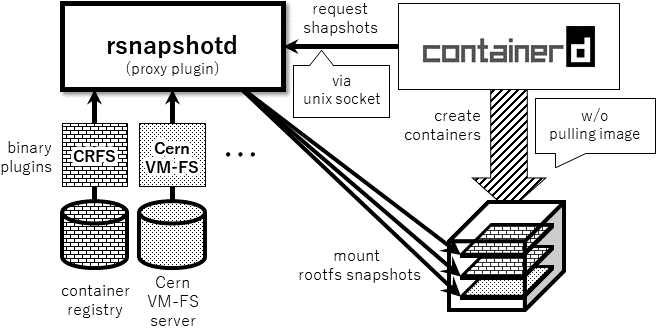

# Containerd Stargz Snapshotter Overview

__Before read through this overview document, we recommend you to try Demo in [README](README.md) to make sure this snapshotter's functionality.__

Pulling image is one of the time-consuming steps in the container startup process.
In containerd community, we have had a lot of discussions to address this issue as follows,

- [#3731 Support remote snapshotter to speed up image pulling](https://github.com/containerd/containerd/issues/3731)
- [#2968 Support `Prepare` for existing snapshots in Snapshotter interface](https://github.com/containerd/containerd/issues/2968)
- [#2943 remote filesystem snapshotter](https://github.com/containerd/containerd/issues/2943)

The solution for the fast image distribution is called *Remote Snapshotter* in containerd community.
This creates container's rootfs layers by directly mounting from remote stores, which is much faster than downloading and unpacking the whole image contents.
We call these remotely mounted layers as *remote snapshots*.

*Stargz Snapshotter* is a remote snapshotter plugin implementation which supports standard compatible remote snapshots functionality.
The image format that achieves it is _stargz_ by [CRFS](https://github.com/google/crfs).
Stargz format is backwards-compatible to container standards so you can push stargz-formatted images to container registries and run them using container runtimes including Docker.
When you run a container image and it is formatted as stargz image, Stargz Snapshotter automatically prepares container's rootfs layers as remote snapshots.
As an image converter command, you can use CRFS-official `stargzify` or our `ctr-remote` which has additional optimization functionality.

This document gives you a high-level overview of Stargz Snapshotter.



## Stargz Snapshotter Proxy Plugin

Stargz Snapshotter is implemented as a proxy plugin of containerd.
The daemon binary is named `containerd-stargz-grpc`.
Because it runs as a standalone daemon process, you can package all dependencies of Stargz Snapshotters and filesystems into one container and deploy it on each node.
For more information of containerization, see docker-compose file in this repo.

## CRFS Stargz Image Format

Stargz Snapshotter supports stargz image format.
This format is backwards-compatible to container standards so you can manage formatted images in same ways as standard container images e.g. pushing to and pulling from container registries, running it with Docker, etc.
When you run a stargz-formatted image, Stargz Snapshotter prepares container's rootfs layers as remote snapshots and actual file contents are fetched in chunk granularity on each access to each file.
You can also use `~/.docker/config.json`-based authentication for your private registries.

Because file contents are fetched via NW on each access, read performance would be one of the major concerns.
To mitigate it, Stargz Snapshotter provides additional workload-oriented optimization.
When you convert an image to stargz format using `ctr-remote`, you can specify some options which describe your workload  (i.e. entrypoint commands, environment variables, etc.).
For example, we can optimize `ubuntu:18.04` image for execution of `ls` command on `bash` as following,

```
# ctr-remote image optimize --plain-http --entrypoint='[ "/bin/bash", "-c" ]' --args='[ "ls" ]' \
             ubuntu:18.04 http://registry2:5000/ubuntu:18.04
```

Then it runs the workload in an isolated environment, monitor all file events, and marks accessed files, which are also likely accessed in your production environment too).
When Stargz Snapshotter prepares the rootfs, it prefetches and caches marked files.
This prefetch ends soon in most cases because the total size of marked files is commonly much smaller than the entire image (Docker Slim is one of the well-known optimization tools which leverages this property).
Eventually, you will read most contents from the cache during runtime, which leads to much better read performance.

## Make your remote snapshotter

It is easy for you to implement your remote snapshotter using [our general snapshotter package](/snapshot) without considering the protocol between that and containerd.
You can configure the remote snapshotter with your `FileSystem` structure which you want to use as a backend filesystem.
[Our snapshotter command](/cmd/containerd-stargz-grpc/main.go) is a good example for the integration.
